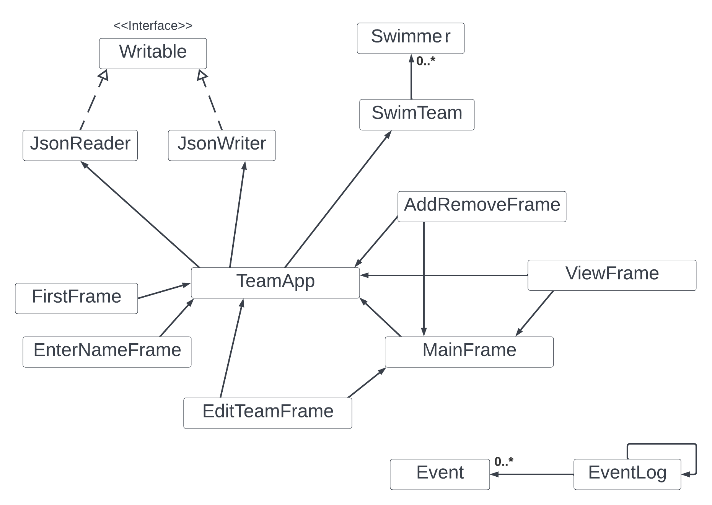

# Swim Team Application
## Coach assisting software
****

This application's goal is to help a swim team coach 
understand the strengths and weaknesses of specific
members of the team. The application works by adding,
and evaluating members and their stats. Based on this 
information, the can calculate and display the statistics
for the team and its members. The coach using this 
application could then make informed decisions, such
as:
- suggesting a main stroke
- suggesting strengths to fortify
- suggesting weaknesses to work on.  

This information can help coaches determine what specific 
students should work on. Furthermore, the application
can display all the stats of the student to the 
coaches. Stats can be added later as well.

This topic interested me as I used to be the captain of my 
high school swim team, and things like this were on my
mind when trying to help out my teammates in the best
way possible. Furthermore, Coaches like my old coaches
worked hard at helping out the team by coming up with
routines that would help us all grow. Software like 
this can help out coaches create routines, and also
personalize them for members to help them improve.

## User Stories
****
as a user of this application, I want to be able to do
the following: 
- Add new members to a swim team
- Remove existing members from the team
- View the entire team, with all the members on it
- choose a team captain and vice-captain who I can see at the top of team view
- Set a new max size of the team (as a coach, if budget increases, then can accommodate more members)
- view the average statistics of the entire team
- view and edit the statistics of a specific member
- save my team, members and their stats onto a file
- load my team, members and their stats from a file

## Phase 4: task 2
****
In this phase, I added event logging to my software.
This will track changes made to the team such as:
- creation
- changing name
- changing max size
- adding/ removing members
The logs will be printed to the console after quiting
the program. Below is a preview of how this will look:

Wed Aug 10 12:07:08 PDT 2022
team UBC Dolphins created

Wed Aug 10 12:07:32 PDT 2022
team name changed to UBC Dolphinsss

Wed Aug 10 12:07:37 PDT 2022
team max size changed to 15

Wed Aug 10 12:08:02 PDT 2022
Finn added to the team

Wed Aug 10 12:08:11 PDT 2022
Jake added to the team

Wed Aug 10 12:08:31 PDT 2022
Bonnibel Bubblegum added to the team

Wed Aug 10 12:09:21 PDT 2022
Bonnibel Bubblegum removed from the team

## Phase 4: task 3
****
***Reflection***

The image above is the UML class diagram for my finished project.
One thing I noticed is that there is a lot of coupling
between TeamApp, MainFrame, and EditTeamFrame, ViewFrame,
and AddRemoveFrame. Furthermore, There is a lot of code duplication
in my code as the GUI classes share a lot of the same
functionality for display and processing.

***Places to improve***
- I could have refactored the code by abstracting
similar code across all the GUI classes. 
- The coupling between my classes can be reduced. The MainFrame
class calls the TeamApp class, which is required by most
other GUI classes. I can have the other GUI classes 

